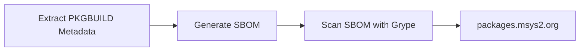

# Vulnerability Reporting

We use [msys2-sbom](https://github.com/msys2/msys2-devtools) to create a [CycloneDX SBOM file](https://cyclonedx.org/) based on the contents of the git repo [in CI](https://github.com/msys2/MINGW-packages/actions/workflows/generate-srcinfo.yml). We then use [grype](https://github.com/anchore/grype) to scan the SBOM and create another SBOM file with [VEX data](https://cyclonedx.org/capabilities/vex/). The [msys2-web site](https://github.com/msys2/msys2-web) then parses these files and displays
the known potential vulnerabilities on https://packages.msys2.org/outofdate and https://packages.msys2.org/security.



## Package Metadata

The following metadata is used to generate the SBOM file, so that CVEs etc. can be matched to our packages:

In the `msys2_references` field in each `PKGBUILD` file the `cpe` key, the `purl` and the `pypi` keys are used to match to CVEs.
The more references the better. Language ecosystem specific references such as pypi and cargo are preferred. For more information about the fields see [PKGBUILD](./pkgbuild.md).

Example:

```bash
msys2_references=(
  "cpe: cpe:/a:python-cryptography_project:python-cryptography"
  "cpe: cpe:2.3:a:cryptography_project:cryptography"
  "pypi: cryptography"
  "purl: pkg:pypi/cryptography"
)
```

## Where to find CPEs and other IDs?

* For Python packages search the package on https://pypi.org
* For Rust packages search the package on https://crates.io
* CPEs can be found on Repology: https://repology.org/project/openssl/cves
* CPEs can also be found on Anitya: https://release-monitoring.org/project/2566
* CPEs can also be found using the official CPE search, but it is very slow and returns too many unrelated results most of the time: https://nvd.nist.gov/products/cpe/search

## TODO

* Some automated way to sync/update CPEs
* Add metadata field to ignore certain CVEs for certain packages
* Add metadata field for the real upstream version, in case we use a different format
