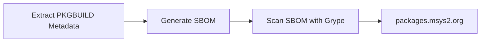

# Vulnerability Reporting

We use [msys2-sbom](https://github.com/msys2/msys2-devtools) to create a [CycloneDX SBOM file](https://cyclonedx.org/) based on the contents of the git repo [in CI](https://github.com/msys2/MINGW-packages/actions/workflows/generate-srcinfo.yml). We then use [grype](https://github.com/anchore/grype) to scan the SBOM and create another SBOM file with [VEX data](https://cyclonedx.org/capabilities/vex/). The [msys2-web site](https://github.com/msys2/msys2-web) then parses these files and displays
the known potential vulnerabilities on https://packages.msys2.org/outofdate and https://packages.msys2.org/security.



## Package Metadata

The following metadata is used to generate the SBOM file, so that CVEs etc. can be matched to our packages:

In the `msys2_references` field in each `PKGBUILD` file the `cpe` and `purl` entries are used to match to CVEs.
The more references the better. Language ecosystem specific references such as pypi and cargo are preferred. For more information about the fields see [PKGBUILD](./pkgbuild.md).

Example:

```bash
msys2_references=(
  "purl: pkg:pypi/cryptography"
  "cpe: cpe:/a:python-cryptography_project:python-cryptography"
  "cpe: cpe:2.3:a:cryptography_project:cryptography"
)
```

In case the version format of the referenced ecosystem is different from the PKGBUILD version, you can specify the version:

```bash
pkgver=1.0dev1
_pypiver=1.0.dev1
msys2_references=(
  "purl: pkg:pypi/example@${_pypiver}"
  "cpe: cpe:/a:example:example:${_pypiver}"
  "cpe: cpe:2.3:a:example:example:${_pypiver}"
)
```

If a discovered vulnerability doesn't affect our users in the first place (it's
Unix only for example), or is already fixed (missing or wrong version
information attached to the vulnerability info), or we have backported a fix for
it, then we can mark it as ignored by adding the ID to the
`msys2_ignore_vulnerabilities` list.

Example:

```bash
msys2_ignore_vulnerabilities=(
  "CVE-2006-2453"  # some reason why this should be ignored
)
```

## Where to find CPEs and other IDs?

* For Python packages search the package on https://pypi.org
* For Rust packages search the package on https://crates.io
* CPEs can be found on Repology: https://repology.org/project/openssl/cves
* CPEs can also be found on Anitya: https://release-monitoring.org/project/2566
* CPEs can also be found using the official CPE search, but it is very slow and returns too many unrelated results most of the time: https://nvd.nist.gov/products/cpe/search

## TODO

* Some automated way to sync/update CPEs
* Add metadata field for the real upstream version, in case we use a different format
