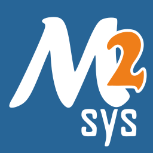
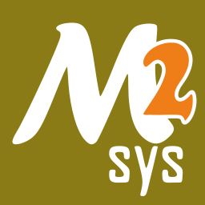
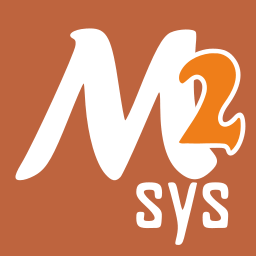
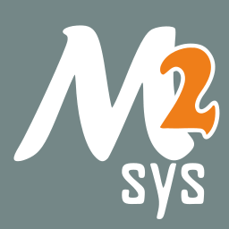

# Environments

MSYS2 comes with different environments/subsystems and the first thing you have
to decide is which one to use. The differences between the environments is
mainly between environment variables, default compilers/linkers, architecture,
system libraries used etc. If you are unsure, go with **MINGW64**.

The **MSYS** environment contains the unixy/cygwin based tools, lives under
`/usr` and is special in that it is always active. All the other environments
inherit from the **MSYS** one and add various things on top of it.

For example in the **MINGW64** environment your `$PATH` starts with
`/mingw64/bin:/usr/bin` so you get all mingw64 based tools as well as all msys
tools.

## Overview

|| Name | Prefix | Toolchain | Architecture | C Library | C++ Library |
| - |-  |-       |-|-|-|-|
| {: style="max-width:25px" } | **MSYS** | `/usr` | gcc | x86_64 | cygwin | libstdc++ |
| {: style="max-width:25px" } | **MINGW64** | `/mingw64` | gcc | x86_64 | msvcrt | libstdc++ |
| {: style="max-width:25px" } | **UCRT64** | `/ucrt64` | gcc | x86_64 | ucrt | libstdc++ |
| {: style="max-width:25px" } | **CLANG64** | `/clang64` | llvm | x86_64 | ucrt | libc++ |
| {: style="max-width:25px" } | **MINGW32** | `/mingw32` |  gcc | i686  | msvcrt | libstdc++ |

