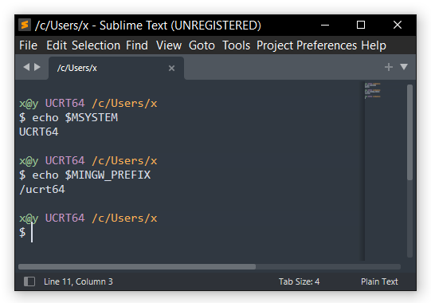

# IDEs and Text Editors

## Sublime Text

{: align=right width=45% }

[Sublime Text](https://www.sublimetext.com/) is a text and source code editor.
It features syntax highlighting, code folding, terminal output window, and more.
To add the MSYS2 terminal profile in Sublime Text, please follow these steps:

* Install [Terminus package](https://packagecontrol.io/packages/Terminus) using
  Package Control.

* In the menu bar, select Preferences > Package Settings > Terminus > Settings
  option. This will open Terminus.sublime-settings file in separate Sublime Text
  window with two panes.

* In the right pane, add the following configuration for UCRT64.

* Change the command options as usual to use other terminal environments. If the
  Terminus.sublime-settings is not empty append the above section after others.

```json
{
  "shell_configs": [
    {
      "name": "UCRT64",
      "cmd": [
        "cmd.exe",
        "/c",
        "C:\\msys64\\msys2_shell.cmd -defterm -here -no-start -ucrt64"
      ],
      "env": {},
      "enable": true,
      "platforms": ["windows"]
    }
  ]
}
```

* Now the UCRT64 environment can be opened like any other shell in Sublime Text.
  Press Ctrl + Shift + P > Terminus: List shells > UCRT64 > Open in tab or pane.

## Visual Studio Code

Add these lines to your `settings.json`:

```jsonc
{
    "terminal.integrated.profiles.windows": {
        "MSYS2 UCRT": {
            "path": "cmd.exe",
            "args": [
                "/c",
                "C:\\msys64\\msys2_shell.cmd -defterm -here -no-start -ucrt64"
            ]
        }
    }
}
```

Now the `MSYS2 UCRT` profile is available when launching a terminal.

## Zed

[Zed](https://zed.dev/) is a text and source code editor. Its syntax
highlighting and source parsing is based on tree-sitter library. Editor uses
Vulkan as GUI backend to have highest performance among other editors. Zed
package provides `zeditor` CLI installed under bin/ directory and `zed-editor`
executable installed under lib/zed/ directory. To use MSYS2 shell in integrated
terminal, press Ctrl + , to open settings, then put these lines in the opened
file

```json
{
  "terminal": {
    "shell": {
      "with_arguments": {
        "program": "cmd.exe",
        "args": ["/c", "C:\\msys64\\msys2_shell.cmd", "-defterm", "-here", "-no-start", "-ucrt64"]
      }
    },
    "env": {
      "EDITOR": "zeditor.exe --wait"
    }
  }
}
```

Now UCRT64 shell will be opened if you press Ctrl + ~. EDITOR environment
variable will be helpful, for example, when you use git from command line.
