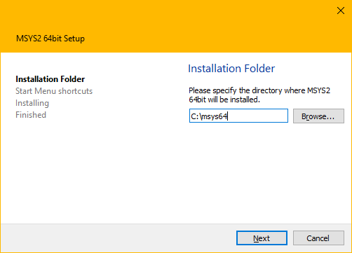
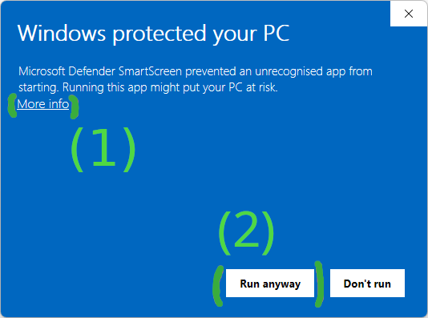

# MSYS2 Installer

The [MSYS2 installer](https://github.com/msys2/msys2-installer) can be used to
set up an initial MSYS2 environment. For further updating pacman is used. See
[the updating guide](./updating.md) for more information.



The installer comes in four variants:

* `msys2-x86_64-.exe`: The GUI installer (see screenshot above)
* `msys2-base-x86_64-*.sfx.exe`: Just the files in a self extracting archive (missing Windows integration like shortcuts, uninstall entry, but otherwise works the same)
* `msys2-base-x86_64-*.tar.zst`: Same as `.sfx.exe` but as an ZSTD archive
* `msys2-base-x86_64-*.tar.xz`: Same as `.sfx.exe` but as an XZ archive (deprecated)

The installer executables and tarballs are hosted on
[GitHub](https://github.com/msys2/msys2-installer/releases) as well as on the
[repo server](https://repo.msys2.org/distrib). We also provide [nightly
builds](https://github.com/msys2/msys2-installer/releases/tag/nightly-x86_64).

## CLI Usage Examples

The GUI installer utilizes the [Qt Installer
Framework](https://doc.qt.io/qtinstallerframework/) which also offers CLI
options for automation.

Installing the GUI installer via the CLI to `C:\msys64`:

```powershell
.\msys2-x86_64-latest.exe in --confirm-command --accept-messages --root C:/msys64
```

Uninstalling an existing installation in `C:\msys64` via the CLI:

```powershell
C:\msys64\uninstall.exe pr --confirm-command
```

Installing the self extracting archive to `C:\msys64`:

```powershell
.\msys2-base-x86_64-latest.sfx.exe -y -oC:\
```

## FAQ

### What's the difference between the installer and the archives?

The installer provides some additional features such as installing shortcuts, registering an uninstaller, a GUI for selecting the installation path and automatically running a login shell at the end to initialize the MSYS2 environment.

If you unpack the archives and run a login shell once, you will get a functionally equivalent MSYS2 installation.

### What is contained in the installer/archives?

It contains the [base](https://packages.msys2.org/package/base) package and all its dependencies. You can list the contained packages using: `pactree base -lu | sort`

### How can I verify the basic integrity of the downloaded files?

!!! note

     The examples below use old releases and checksums as examples.
     Make sure to adjust the version numbers and checksums to the ones
     of the release you are verifying.

You can download the expected checksum by appending `.sha256` to each download URL. You can verify that the downloaded file matches the checksum by computing the checksum either with Powershell:

```powershell
(Get-FileHash -Algorithm SHA256 -Path .\msys2-x86_64-20230526.exe).Hash.toLower()
432dcc8b5cc7d5104a85b52df8b1e77cdf91018e102ac7aa998248637d636229
```

or with 7-Zip, if you have it installed:

* Right clicking on `msys2-x86_64-20230526.exe`
* Go into the "7-Zip" and then "CRC SHA" sub menu, and finally click on "SHA-256"
* 7-Zip will pop up a window containing the checksum

Compare the result with the content of "https://github.com/msys2/msys2-installer/releases/download/2023-05-26/msys2-x86_64-20230526.exe.sha256" to verify that your local file matches the checksum.

### How can I verify that the downloaded files were generated by MSYS2 developers?

The installer is signed using the following key:

[`0EBF 782C 5D53 F7E5 FB02  A667 46BD 761F 7A49 B0EC`](http://keyserver.ubuntu.com/pks/lookup?search=0x0ebf782c5d53f7e5fb02a66746bd761f7a49b0ec&fingerprint=on&op=vindex)

You can download the signature by appending a `.sig` to all download URLs.

Verification example:

```console
$ gpg --keyserver keyserver.ubuntu.com --recv "0EBF 782C 5D53 F7E5 FB02  A667 46BD 761F 7A49 B0EC"
gpg: key 46BD761F7A49B0EC: public key "Christoph Reiter <reiter.christoph@gmail.com>" imported
gpg: Total number processed: 1
gpg:               imported: 1
$ ls
msys2-x86_64-20230526.exe  msys2-x86_64-20230526.exe.sig
$ gpg --verify msys2-x86_64-20230526.exe.sig
gpg: assuming signed data in 'msys2-x86_64-20230526.exe'
gpg: Signature made Fr 26 Mai 2023 11:46:54 CEST
gpg:                using RSA key E0AA0F031DBD80FFBA57B06D5A62D0CAB6264964
gpg: Good signature from "Christoph Reiter <reiter.christoph@gmail.com>" [unknown]
gpg: WARNING: This key is not certified with a trusted signature!
gpg:          There is no indication that the signature belongs to the owner.
Primary key fingerprint: 0EBF 782C 5D53 F7E5 FB02  A667 46BD 761F 7A49 B0EC
     Subkey fingerprint: E0AA 0F03 1DBD 80FF BA57  B06D 5A62 D0CA B626 4964
```

For the signature to be valid, gnupg has to print "Good signature" **and** the primary fingerprint shown has to match `0EBF 782C 5D53 F7E5 FB02  A667 46BD 761F 7A49 B0EC`.

### Microsoft Defender SmartScreen prevents me from running the installer

Depending on the age of the installer release and how many people have already
used it successfully, Windows will show a SmartScreen warning, preventing you
from running the installer.

You can skip this warning by first clicking on "More info" and then on "Run
anyway".

{: style="max-width:450px" }
