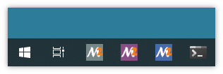
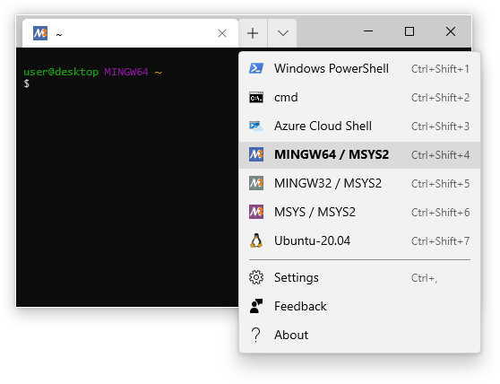

# Terminals

## Mintty

{: align=right width=45% }

{: align=right style="clear:both" width=45% }

[Mintty](https://mintty.github.io) is the default terminal application in MSYS2
and is included in the installer. We also include some custom Mintty integration
by providing separate launchers with corresponding .ini configuration files
(msys2{.exe,.ini}/mingw32{.exe,.ini}/mingw64{.exe,.ini}) for all the MSYS2
environments, so you can easily configure your environments and pin the
launchers to your Windows taskbar.


See https://github.com/msys2/msys2-launcher and https://mintty.github.io for
more details.<br style="clear:both"/>


## Windows Terminal

{: align=right width=45% }

The new Windows Terminal application, which by default supports cmd, powershell
and WSL can also be extended to support a MSYS2 shell.

* Get it via the [Windows app store](https://aka.ms/terminal) if you don't have
  it installed already.
* In the tab dropdown menu select "Settings" which opens a code editor showing
  a JSON configuration file.
* Insert the example profiles shown below under the `profiles` key. Note that
  the examples assume that you have MSYS2 installed under `C:\msys64`.
* You can make one of the MSYS2 profiles the default by setting the `defaultProfile`
  key to the `guid` value of one of the profile entries.

For more info on the different profile settings see
https://docs.microsoft.com/en-us/windows/terminal/customize-settings/profile-settings <br style="clear:both"/>

```json
// This makes MINGW64 the default shell
"defaultProfile": "{17da3cac-b318-431e-8a3e-7fcdefe6d114}",
"profiles": {
  "list":
  [
    // ...
    {
      "guid": "{17da3cac-b318-431e-8a3e-7fcdefe6d114}",
      "name": "MINGW64 / MSYS2",
      "commandline": "C:/msys64/msys2_shell.cmd -defterm -here -no-start -mingw64",
      "startingDirectory": "C:/msys64/home/%USERNAME%",
      "icon": "C:/msys64/mingw64.ico",
      "font": 
      {
        "face": "Lucida Console",
        "size": 9
      }
    },
    {
      "guid": "{2d51fdc4-a03b-4efe-81bc-722b7f6f3820}",
      "name": "MINGW32 / MSYS2",
      "commandline": "C:/msys64/msys2_shell.cmd -defterm -here -no-start -mingw32",
      "startingDirectory": "C:/msys64/home/%USERNAME%",
      "icon": "C:/msys64/mingw32.ico",
      "font": 
      {
        "face": "Lucida Console",
        "size": 9
      }
    },
    {
      "guid": "{71160544-14d8-4194-af25-d05feeac7233}",
      "name": "MSYS / MSYS2",
      "commandline": "C:/msys64/msys2_shell.cmd -defterm -here -no-start -msys",
      "startingDirectory": "C:/msys64/home/%USERNAME%",
      "icon": "C:/msys64/msys2.ico",
      "font": 
      {
        "face": "Lucida Console",
        "size": 9
      }
    },
    // ...
  ]
}
```

