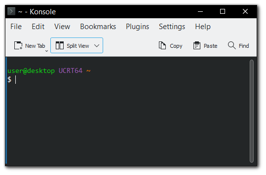
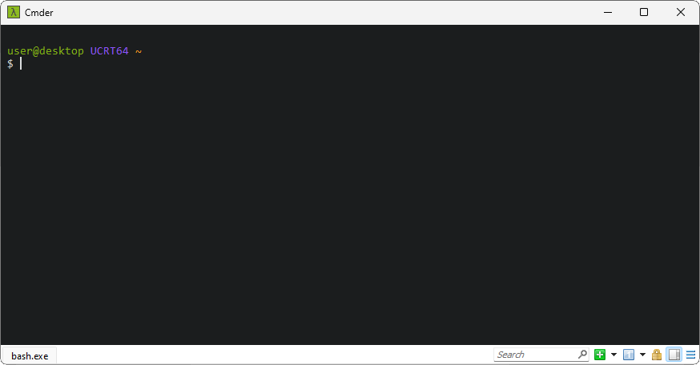

# Terminals

## Mintty

{: align=right width=45% }

{: align=right style="clear:both" width=45% }

[Mintty](https://mintty.github.io) is the default terminal application in MSYS2
and is included in the installer. We also include some custom Mintty integration
by providing separate launchers with corresponding .ini configuration files
(msys2{.exe,.ini}/ucrt64{.exe,.ini}/...) for all the MSYS2
environments, so you can easily configure your environments and pin the
launchers to your Windows taskbar.


See https://github.com/msys2/msys2-launcher and https://mintty.github.io for
more details.<br style="clear:both"/>


## Windows Terminal

{: align=right width=45% }

The new Windows Terminal application, which by default supports cmd, powershell
and WSL can also be extended to support a MSYS2 shell.

* Get it via the [Windows app store](https://aka.ms/terminal) if you don't have
  it installed already.
* In the tab dropdown menu select "Settings" which opens a code editor showing
  a JSON configuration file.
* Insert the example profiles shown below under the `profiles` key. Note that
  the examples assume that you have MSYS2 installed under `C:\msys64`.
* You can make one of the MSYS2 profiles the default by setting the `defaultProfile`
  key to the `guid` value of one of the profile entries.

For more info on the different profile settings see
https://docs.microsoft.com/en-us/windows/terminal/customize-settings/profile-settings <br style="clear:both"/>

```json
// This makes UCRT64 the default shell
"defaultProfile": "{17da3cac-b318-431e-8a3e-7fcdefe6d114}",
"profiles": {
  "list":
  [
    // ...
    {
      "guid": "{17da3cac-b318-431e-8a3e-7fcdefe6d114}",
      "name": "UCRT64 / MSYS2",
      "commandline": "C:/msys64/msys2_shell.cmd -defterm -here -no-start -ucrt64",
      "startingDirectory": "C:/msys64/home/%USERNAME%",
      "icon": "C:/msys64/ucrt64.ico",
      "font": 
      {
        "face": "Lucida Console",
        "size": 9
      }
    },
    {
      "guid": "{71160544-14d8-4194-af25-d05feeac7233}",
      "name": "MSYS / MSYS2",
      "commandline": "C:/msys64/msys2_shell.cmd -defterm -here -no-start -msys",
      "startingDirectory": "C:/msys64/home/%USERNAME%",
      "icon": "C:/msys64/msys2.ico",
      "font": 
      {
        "face": "Lucida Console",
        "size": 9
      }
    },
    // ...
  ]
}
```

* The `commandline` in that profile will launch bash shell by default. To change
  default login shell, install the corresponding package for that shell and append
  `-shell` option with the command line. For example,
  - To set `fish` shell as default:
    ```
    "commandline": "C:/msys64/msys2_shell.cmd -defterm -here -no-start -ucrt64 -shell fish"
    ```
  - To set `zsh` shell as default:
    ```
    "commandline": "C:/msys64/msys2_shell.cmd -defterm -here -no-start -ucrt64 -shell zsh"
    ```

## Konsole

{: align=right width=45% }

[Konsole](https://konsole.kde.org/) is a powerful and customizable terminal
emulator made by KDE. MSYS2 provides it as a [mingw package](https://packages.msys2.org/base/mingw-w64-konsole).
To use it with MSYS2, first install the appropriate package and create a new
profile with the following steps.

* In the Konsole window menu bar, select "Settings" > "Create New Profile...".
* Select it as a default profile to always open msys2 environment at start.
* Add profile name and following command.

```
C:\\msys64\\msys2_shell.cmd -defterm -here -no-start -ucrt64
```

* Now close and restart Konsole.

### Cmder

{: align=right width=45% }

[Cmder](https://cmder.app/) is a portable console emulator for Windows based on [ConEmu](https://conemu.github.io/) that aims to provide a portable and convenient terminal for Windows. It comes bundled with all the popular UNIX commands and supports a Quake-style slide drop down that allows immediate access to the terminal via a global keyboard shortcut.

To use it with MSYS2, click the hamburger menu on the right lower bar and click `settings` to open the settings window. 

1. Navigate to `Startup` > `Tasks` and then click the `+` symbol to create a new task. You can set to any name you like, for example `bash::msys2 ucrt64`.

2.  In the command section, copy the following script:

  ```cmd
  set MSYSTEM=UCRT64 & set "CHERE_INVOKING=1" & "C:\msys64\usr\bin\bash.exe" --login -i
  ```

3. Click `Save Settings` button.

4. Open a new tab with the shortcut `Ctrl + T`. On the new console dialog, select the `task` you just created and then click the `Start` button. 

To customize further, you can press `Ctrl + Alt + P` to open the settings window and set the task you created as the default one.  You can also click the `Startup dir` button to change the default startup directory.
