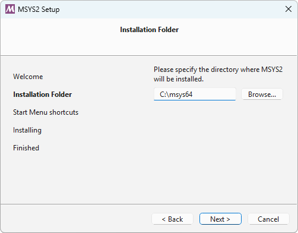
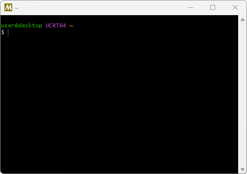

<header>
<h1>MSYS2</h1>
<h2>Software Distribution and Building Platform for Windows</h2>
</header>

#

**MSYS2** is a collection of tools and libraries providing you with an
easy-to-use environment for building, installing and running native Windows
software.

It consists of a command line terminal called
[mintty](https://mintty.github.io/), bash, version control systems like git and
subversion, tools like tar and awk and even build systems like autotools, all
based on a modified version of [Cygwin](https://cygwin.com). Despite some of
these central parts being based on Cygwin, the main focus of MSYS2 is to provide
a build environment for native Windows software and the Cygwin-using parts are
kept at a minimum. MSYS2 provides up-to-date native builds for GCC, mingw-w64,
CPython, CMake, Meson, OpenSSL, FFmpeg, Rust, Ruby, just to name a few.

To provide easy installation of packages and a way to keep them updated it
features a package management system called
[Pacman](https://wiki.archlinux.org/index.php/pacman), which should be familiar
to Arch Linux users. It brings many powerful features such as dependency
resolution and simple complete system upgrades, as well as straight-forward and
reproducible package building. Our package repository contains [more than 2800
pre-built packages](https://packages.msys2.org/base) ready to install.

For more details see ['What is MSYS2?'](docs/what-is-msys2.md) which also
compares MSYS2 to other software distributions and development environments like
[Cygwin](https://cygwin.com),
[WSL](https://en.wikipedia.org/wiki/Windows_Subsystem_for_Linux),
[Chocolatey](https://chocolatey.org/), [Scoop](https://scoop.sh/), ... and ['Who
Is Using MSYS2?'](docs/who-is-using-msys2.md) to see which projects are using
MSYS2 and what for.


## Installation

1. Download the installer: <a href="https://github.com/msys2/msys2-installer/releases/download/2023-05-26/msys2-x86_64-20230526.exe" class="button">msys2-x86_64-20230526.exe</a>

    <span style="opacity: 0.6; word-wrap: break-word;">Verify with SHA256 checksum `432dcc8b5cc7d5104a85b52df8b1e77cdf91018e102ac7aa998248637d636229`
    or [GPG signature](https://github.com/msys2/msys2-installer/releases/download/2023-05-26/msys2-x86_64-20230526.exe.sig)
    by [0xf7a49b0ec](http://keyserver.ubuntu.com/pks/lookup?search=0x0ebf782c5d53f7e5fb02a66746bd761f7a49b0ec&fingerprint=on&op=vindex).</span>

2. Run the installer. MSYS2 requires 64 bit Windows 8.1 or newer.

3. Enter your desired **Installation Folder** (short ASCII-only path on a NTFS volume, no accents, no spaces, no symlinks, no subst or network drives, no FAT).

    

4. When done, click **Finish**.

    

5. Now MSYS2 is ready for you and a terminal for the [UCRT64 environment](./docs/environments.md) will launch.

    

6. You will probably want to install some tools like the mingw-w64 GCC to start compiling projects. Run the following command:

    ```console
    pacman -S mingw-w64-ucrt-x86_64-gcc
    ```

7. The terminal window will show the output as below. Press 'Enter' to continue:

    ```console
    resolving dependencies...
    looking for conflicting packages...

    Packages (15) mingw-w64-ucrt-x86_64-binutils-2.39-2
                mingw-w64-ucrt-x86_64-crt-git-10.0.0.r68.g6eb571448-1
                mingw-w64-ucrt-x86_64-gcc-libs-12.2.0-1  mingw-w64-ucrt-x86_64-gmp-6.2.1-3
                mingw-w64-ucrt-x86_64-headers-git-10.0.0.r68.g6eb571448-1
                mingw-w64-ucrt-x86_64-isl-0.25-1  mingw-w64-ucrt-x86_64-libiconv-1.17-1
                mingw-w64-ucrt-x86_64-libwinpthread-git-10.0.0.r68.g6eb571448-1
                mingw-w64-ucrt-x86_64-mpc-1.2.1-1  mingw-w64-ucrt-x86_64-mpfr-4.1.0.p13-1
                mingw-w64-ucrt-x86_64-windows-default-manifest-6.4-4
                mingw-w64-ucrt-x86_64-winpthreads-git-10.0.0.r68.g6eb571448-1
                mingw-w64-ucrt-x86_64-zlib-1.2.12-1  mingw-w64-ucrt-x86_64-zstd-1.5.2-2
                mingw-w64-ucrt-x86_64-gcc-12.2.0-1

    Total Installed Size:  397.59 MiB

    :: Proceed with installation? [Y/n]
    [... downloading and installation continues ...]
    ```

8. Now you can call `gcc` to build software for Windows.

    ```console
    $ gcc --version
    gcc.exe (Rev1, Built by MSYS2 project) 12.2.0
    ```

9. After installing MSYS2 it will update itself via `pacman`, see the [update guide](./docs/updating.md) for more information.


## Sponsors

Our main server is sponsored by [jsDelivr](https://www.jsdelivr.com)

[{: width=250px}{: width=250px}](https://www.jsdelivr.com)

[ExtremeIX](https://extreme-ix.org/) sponsors our mirror in India

[{: width=250px}](https://extreme-ix.org/)

[Microsoft Open Source Programs Office](https://opensource.microsoft.com/) sponsors us financially via their [FOSS Fund](https://github.com/microsoft/foss-fund#2022)

[{: width=250px}{: width=250px}](https://opensource.microsoft.com/)

Various organizations provide us with mirrors all around the world, see [our mirror list](dev/mirrors.md) for details.

##  Authors and Contributors

* [Alexpux (Alexey Pavlov)](https://github.com/Alexpux)
* [martell (Martell Malone)](https://github.com/martell)
* [mingwandroid (Ray Donnelly)](https://github.com/mingwandroid)
* [Elieux (David Macek)](https://github.com/elieux)
* [lazka (Christoph Reiter)](https://github.com/lazka)
* [Renato Silva](https://github.com/renatosilva)
* [niXman](https://github.com/niXman)
* [naveen521kk (Naveen M K)](https://github.com/naveen521kk)
* [Biswa96 (Biswapriyo Nath)](https://github.com/Biswa96)
* [jeremyd2019 (Jeremy Drake)](https://github.com/jeremyd2019)
* [mati865 (Mateusz Mikuła)](https://github.com/mati865)
* [MehdiChinoune (مهدي شينون / Mehdi Chinoune)](https://github.com/MehdiChinoune)

## Donations

You can donate to the project via [GitHub Sponsors](https://github.com/sponsors/msys2):

[{: width=150px}{: width=150px}](https://github.com/sponsors/msys2)

or via [Open Collective](https://opencollective.com/msys2):

[{: width=280px}](https://opencollective.com/msys2)
